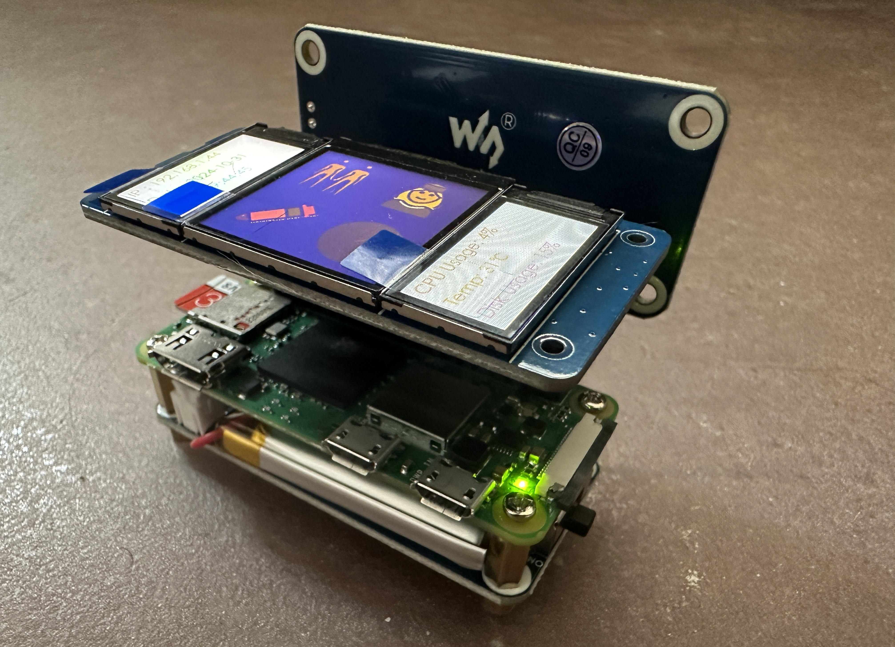
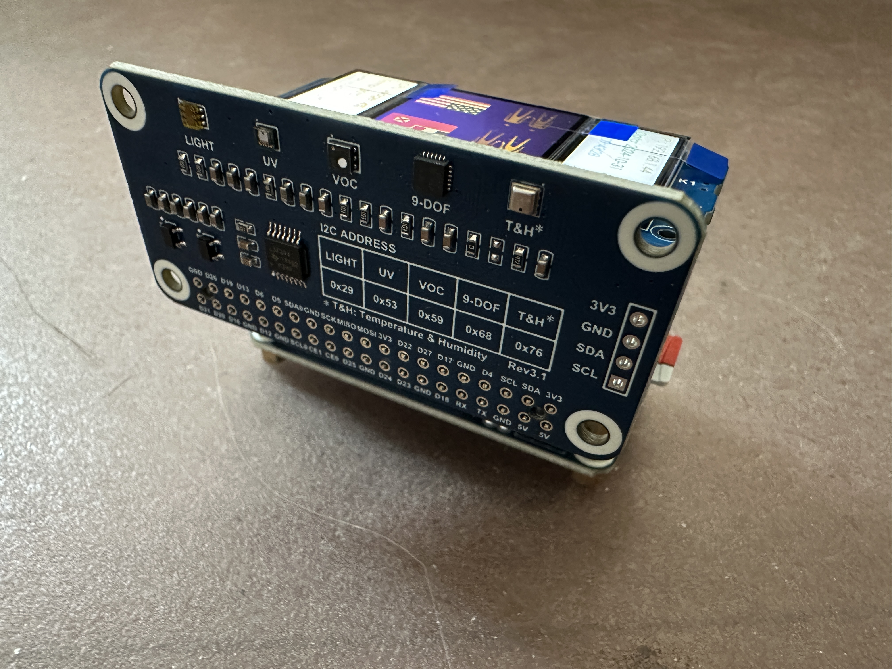

# ByteBeast 🐾

A device-centric virtual pet that reacts to the real world via onboard sensors, shows its mood and evolution with OpenMoji emojis on a triple-screen LCD HAT, and can interact with nearby pets.

## Hardware Photos


*ByteBeast running on Raspberry Pi Zero 2W with triple LCD display showing live emoji interface*


*Sensor HAT showing I2C pinout and environmental sensor specifications*

## Overview

ByteBeast is a Tamagotchi-style virtual pet designed to run on Raspberry Pi Zero 2W with multiple HAT modules. It features:

- **Environment-aware behavior** - Responds to light, temperature, humidity, pressure, motion, and battery state
- **Emoji-based UI** - Uses OpenMoji emojis across three LCD displays (1.3" main + two 0.96" auxiliary)
- **Evolution system** - Six evolution paths based on sustained environmental exposure
- **Mood engine** - Rule-based mood inference with 10 different moods
- **Needs & traits** - Hunger, rest, social, and hygiene needs that drift over time
- **Power management** - Battery-aware display policies and safe shutdown
- **Social features** - Planned for future implementation

## Hardware Requirements

### Raspberry Pi Setup
- Raspberry Pi Zero 2W (or compatible models)
- Raspberry Pi OS or compatible Linux distribution
- MicroSD card (32GB+ recommended)
- Power supply with UPS capability

### HAT Modules
1. **Waveshare Sense HAT (C)** - I²C sensors:
   - QMI8658C (accelerometer/gyroscope) + AK09918 (magnetometer)
   - SHTC3 (temperature/humidity)
   - LPS22HB (pressure sensor)
   - TCS34725 (RGB/clear light sensor)

2. **Waveshare UPS HAT (C)** - I²C power monitoring:
   - INA219 (voltage/current/power monitoring)
   - Battery management and charging

3. **Waveshare Triple LCD HAT** - SPI displays:
   - Main 1.3" ST7789 (240×240) center display
   - Two 0.96" ST7735S (160×80) side displays
   - 2 tactile buttons for user interaction

## Software Architecture

### Service Architecture (4 systemd services)

1. **bytebeast-sense.service** - Sensor data collection & feature extraction
2. **bytebeast-state.service** - Mood/needs/evolution engine
3. **bytebeast-viz.service** - Emoji rendering to LCD displays  
4. **bytebeast-power.service** - Battery monitoring & power management

**Note**: Social features are planned but not yet implemented.

### Data Flow
```
[Sensors (I2C)] → [bytebeast-sense] → features →
                                               ↓
                 [bytebeast-state] ← mood/needs/evolution
                          ↓
        [bytebeast-viz] ← emoji frames
                 ↓
   [LCD Displays (SPI)] ← rendered UI

[Power (INA219)] → [bytebeast-power] → policies →
                                               ↓
                                    [all services]
```

## Installation

### 1. Hardware Setup

Enable SPI and I2C interfaces:
```bash
# Add to /boot/config.txt
dtparam=spi=on
dtparam=i2c_arm=on
dtoverlay=spi1-1cs  # For 1.3" display on SPI1
```

### 2. Dependencies

Install Python dependencies:
```bash
sudo apt update
sudo apt install python3-pip python3-pil python3-yaml python3-smbus
pip3 install pillow pyyaml
```

### 3. Clone Repository

```bash
cd ~
git clone https://github.com/jerryliu816/bytebeast.git
cd bytebeast
```

### 4. Install Services

```bash
./services/install_services.sh
```

### 5. Start ByteBeast

```bash
# Start all services
sudo systemctl start bytebeast.target

# Check status
./services/start_services.sh status

# View logs
journalctl -u bytebeast-sense.service -f
```

## Usage

### Quick Demo

Run the demo script to see ByteBeast in action (mock mode):
```bash
python3 demo.py
```

### Service Management

```bash
# Start/stop services  
./services/start_services.sh start
./services/start_services.sh stop

# Test mode (mock sensors/displays)
./services/start_services.sh start mock

# View service status
./services/start_services.sh status

# View specific service logs
./services/start_services.sh logs viz
```

### Testing

Run the test suite:
```bash
cd tests
python3 run_tests.py
```

Run day simulation:
```bash
python3 tests/simulate_day.py 24
```

## Configuration

Configuration is managed through YAML files in `config/defaults.yaml`.

Key settings:
```yaml
display:
  fps_active: 20          # Normal frame rate
  fps_idle: 3             # Power-saving frame rate
  battery_dim_pct: 20     # Dim below 20% battery
  battery_shutdown_pct: 5 # Shutdown below 5%

thresholds:
  lux_bright: 8000        # Bright light threshold
  temp_hot: 30.0          # Hot temperature (°C)
  temp_cold: 10.0         # Cold temperature (°C)
  
evolution:
  window_hours: 48        # Evolution calculation window
  stage_goal: 1.0         # XP needed for stage progression
```

## ByteBeast Behavior

### Moods (Rule Priority Order)
1. **Hot** (🥵) - Temperature ≥ 30°C
2. **Cold** (🥶) - Temperature ≤ 10°C  
3. **Sick** (🤒) - Low battery or extreme conditions
4. **Sleepy** (😴) - Dark & still for extended time
5. **Playful** (🤩) - Shake events or high activity
6. **Happy** (😃) - Bright & comfortable conditions
7. **Curious** (🧐) - Environmental novelty detected
8. **Bored** (😐) - No novelty & low motion
9. **Anxious** (😰) - Unstable environment or low needs
10. **Calm** (😌) - Default fallback

### Evolution Paths
- **Sun** 🐣→🐥→🦅→🦄 (bright + warm + active)
- **Shadow** 🦇→🦉→🐺→🐉 (dark + quiet + low motion)
- **Ember** 🦁→🔥→🐯→🐉 (hot environments)
- **Frost** 🐧→❄️→🐻‍❄️→🐉 (cold environments)  
- **Social** 🐒→🦁→🦄→👑 (high peer interaction)
- **Lone** 🐭→🦊→🐺→🐉 (solitary exploration)

### Needs System
- **Hunger** - Increases with activity, decreases over time
- **Rest** - Increases in bright light/activity, satisfied by dark/quiet
- **Social** - Decreases over time, satisfied by encounters/novelty
- **Hygiene** - Increases in extreme conditions, satisfied by comfort

### Power Management
- **Normal** (>20% battery): 20 FPS, full brightness
- **Dim** (10-20% battery): 3 FPS, 50% brightness  
- **Static** (5-10% battery): 1 FPS, 20% brightness, static frames only
- **Shutdown** (<5% battery): Warning display, safe shutdown after 60s

## Display Layout

### Main Display (1.3" ST7789 240×240)
- Center: Large emoji (128px) showing current mood
- Top-right: Up to 3 status badges (32px each)
- Bottom: Progress bars for energy and evolution

### Left Display (0.96" ST7735S 160×80)  
- Top: Ambient color strip (derived from light sensor)
- Text: Temperature, humidity, light level

### Right Display (0.96" ST7735S 160×80)
- Battery percentage bar with color coding
- Power consumption and charging status
- Uptime display
- Key hints

## Development

### Project Structure
```
bytebeast/
├── core/           # Data models, database, config
├── sensors/        # Hardware abstraction & feature extraction
├── state/          # Mood engine, evolution, traits  
├── display/        # LCD rendering & emoji management
├── power/          # Battery monitoring & power policies
├── social/         # Peer discovery & encounters (minimal implementation)
├── services/       # Systemd service definitions
├── config/         # YAML configuration files
├── tests/          # Unit tests & simulations
├── environment/    # Environment sensor modules (BME280, ICM20948, etc.)
├── Sense_HAT_C_Pi/ # Comprehensive sensor HAT with C/Python implementations
├── UPS_HAT_C/      # Power management with INA219
└── lib/            # Third-party libraries and GPIO demos
```

### Adding New Features

1. **New Mood Rule**: Edit `state/mood_engine.py` `infer_mood()` method
2. **New Sensor**: Add to `sensors/manager.py` 
3. **Display Changes**: Modify `display/manager.py`
4. **Configuration**: Update `config/defaults.yaml`

### Testing

- Unit tests: `python3 tests/run_tests.py`
- Integration tests: `python3 tests/test_integration.py`
- Day simulation: `python3 tests/simulate_day.py`
- Live demo: `python3 demo.py`

## Troubleshooting

### Common Issues

**Services won't start:**
```bash
# Check hardware permissions
sudo usermod -a -G spi,gpio,i2c $USER
sudo systemctl restart bytebeast.target
```

**Display not working:**
```bash
# Test in mock mode first
./services/start_services.sh start mock

# Check SPI is enabled
ls /dev/spidev*
```

**Sensor errors:**
```bash  
# Test I2C devices
sudo i2cdetect -y 1

# Check service logs
journalctl -u bytebeast-sense.service -f
```

### Logs

Service logs are available via systemd:
```bash
# All services
journalctl -u bytebeast-* -f

# Specific service  
journalctl -u bytebeast-sense.service -f --since "1 hour ago"
```

## Contributing

1. Fork the repository
2. Create a feature branch
3. Add tests for new functionality  
4. Ensure all tests pass
5. Submit a pull request

## License

AGPL-3.0 License - see LICENSE file for details.

## Credits

### Open Source Libraries & Dependencies

- **[OpenMoji](https://openmoji.org/)** - Open source emoji graphics (CC BY-SA 4.0)
- **[lgpio/rgpio](https://github.com/joan2937/lg)** - Modern GPIO library for Linux (Unlicense)
- **[bcm2835](https://www.airspayce.com/mikem/bcm2835/)** - Broadcom BCM 2835 library (GPL)
- **[WiringPi](http://wiringpi.com/)** - GPIO interface library (LGPL)
- **[Pillow (PIL)](https://pillow.readthedocs.io/)** - Python Imaging Library (HPND)
- **[NumPy](https://numpy.org/)** - Numerical computing library (BSD)
- **Python Libraries**: smbus (GPL), spidev (GPL), gpiozero (BSD), RPi.GPIO (MIT)

### Hardware & Platform

- **[Waveshare](https://www.waveshare.com/)** - HAT module designs and hardware drivers
- **[Raspberry Pi Foundation](https://www.raspberrypi.org/)** - Single-board computer platform

---

**ByteBeast** - Where virtual pets meet the real world! 🐾✨